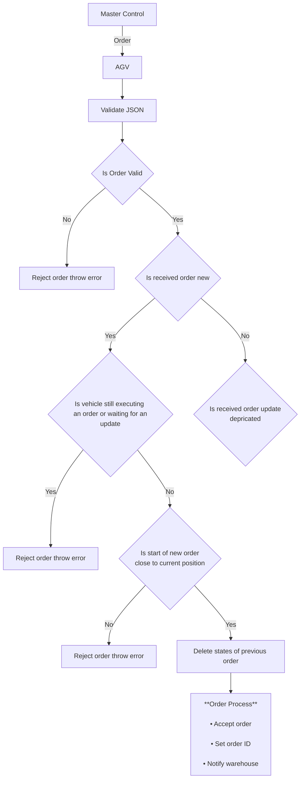

# Robotics Algorithms

Robotics algorithms are not working correctly, this is it, alright, this should do something.

## FlowChart for VDA5050

```mermaid
flowchart TD
    A[Master Control] --> |Order| B[AGV]
    B --> C[Validate JSON]
    C --> D{Is Order Valid}
    D --> |No| E[Reject order throw error]
    D --> |Yes| F{Is received order new}
    F --> |Yes| G{Is vehicle still executing <br/> an order or waiting for an update}
    F --> |No| H{Is received order update <br/> depricated}
    G --> |Yes| I[Reject order throw error]
    G --> |No| J{Is start of new order <br/> close to current position}
    J --> |No| K[Reject order throw error]
    J --> |Yes| L[Delete states of previous order]
    L --> M["**Order Process**
    <br/>• Accept order
    <br/>• Set order ID
    <br/>• Notify warehouse"]


```
